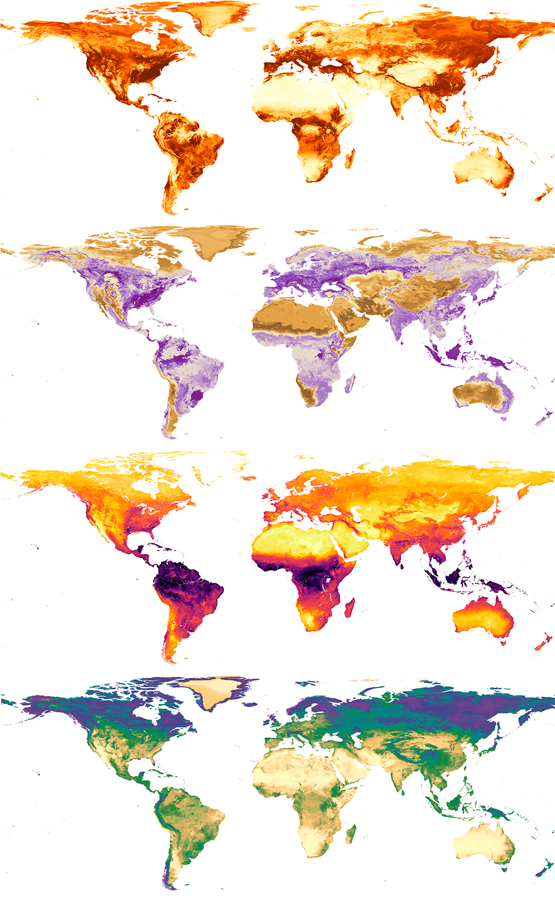

---
output:
  xaringan::moon_reader:
     
    # css: [xaringan-themer.css]
    css: ["default", "metropolis", "metropolis-fonts"]
    nature:
      ratio: '16:9'
      lib_dir: libs
      highlightStyle: github
      highlightLines: true
      countIncrementalSlides: false
      
---

class: clear


```{css echo=FALSE}
.custom-left {
float: left;
width: 65%;
}
.custom-right {
float: right;
width: 35%;
}

.divider-line {
  height: 1px;
  width: 600px;
  background-color: #1A1A2E;
  margin: 30px 0;
  clear: both;
}


```


.custom-left[

## Inteligência artificial aplicada à dimensão pedológica global para modelar, mapear e compreender interações biota-solo-clima e dinâmicas do carbono orgânico

<div class="divider-line"></div>

<div style="position: absolute; bottom: 30px; left: 30px;">

</div>

**Doutorando:** Cássio Moquedace  
**Orientador:** Elpídio Inácio Fernandes Filho  
**Coorientadores:** Lucas Gomes; Rodrigo Vargas
]

.custom-right[

]

<div style="position: absolute; bottom: 30px; left: 30px;">

</div>


---

class: clear, center, middle

<style>
.qr-font {
  font-size: 1.8em;
  font-style: italic;
}
</style>

<a href="https://moquedace.github.io/thesis_slide" target="_blank">
  
  <p class="qr-font">https://moquedace.github.io/thesis_slide</p>
</a>


---

class: sumario-slide

<style>
.sumario-slide h1 {
font-size: 2.5em;
text-align: left;
}

.sumario-slide ul {
font-size: 1.5em;
line-height: 1.8;
padding-left: 40px;
}
</style>

# Sumário

.pull-left[
- Introdução geral  
- Objetivo geral  
- Material e métodos
- Resultados artigo 1  
- Resultados artigo 2  
- Resultados artigo 3  
- Resultados artigo 4  
- Conclusão  geral
- Referências
]


.pull-right[

]


---

class: topic-slide

<style>
.topic-slide h1 {
font-size: 2.5em;
text-align: left;
}

.topic-slide ul li {
font-size: 1em;
line-height: 1.6;
margin-bottom: 0.4em;
}

</style>

# Introdução

- Solo é base da produção de alimentos, regulação climática e biodiversidade

--

- Armazena mais carbono orgânico que atmosfera e biomassa juntas (1.460–1.550 Pg) ([<u>Batjes, 2006</u>](https://doi.org/10.1111/j.1475-2743.2005.tb00102.x); [<u>Lal, 2004</u>](https://doi.org/10.1126/science.1097396))


--

- Está degradado em 33% da superfície global ([<u>Delgado-Baquerizo et al., 2025</u>](https://doi.org/10.1371/journal.pbio.3003093))

--

- Raízes, fungos e respiração do solo são motores biológicos centrais do ciclo do carbono

--

- Negligenciados em modelos globais, que priorizam clima e vegetação


---

class: topic-slide


# Introdução

- Modelos tradicionais requerem pressupostos (ex.: normalidade)

--

- Amostragem limitada (falta de dados)


---


class: slide-hoogen_2019

<style>
.slide-hoogen_2019 {
background-image: url("./img/hoogen_2019.png");
background-size: 50%;
background-position: 98% 80%;
background-repeat: no-repeat;
}

.slide-hoogen_2019 h1 {
font-size: 2.5em;
text-align: left;
}

.slide-hoogen_2019 ul {
font-size: 1.5em;
line-height: 1.8;
padding-left: 40px;
}
</style>


# Introdução

## Soil nematode abundance and functional group composition at a global scale


### *van den Hoogen et al. (2019) | *[<u>*DOI: 10.1038/s41586-019-1418-6*</u>](https://doi.org/10.1038/s41586-019-1418-6)


- **Nature**
- Machine learning (Random forest)
- Abundância total e por grupos tróficos<br>de nematoides do solo
- 6759 amostras / <u>1876 agregadas</u>


---


class: slide-huang_2020

<style>
.slide-huang_2020 {
background-image: url("./img/huang_2020.png");
background-size: 55%;
background-position: 92% 96%;
background-repeat: no-repeat;
}

.slide-huang_2020 h1 {
font-size: 2.5em;
text-align: left;
}

.slide-huang_2020 ul {
font-size: 1.5em;
line-height: 1.8;
padding-left: 40px;
}
</style>


# Introdução

## Spatial and temporal variations in global soil respiration and their relationships with climate and land cover


### *Huang et al. (2020) | *[<u>*DOI: 10.1126/sciadv.abb8508*</u>](https://doi.org/10.1126/sciadv.abb8508)


- **Science Advances**
- Machine learning (Random forest | SVM)
- Respiração do solo (Rs)
- 1292 amostras / <u>701 locais</u>


---


class: slide-baquerizo_2018

<style>
.slide-baquerizo_2018 {
background-image: url("./img/baquerizo_2018.png");
background-size: 55%;
background-position: 87% 99%;
background-repeat: no-repeat;
}

.slide-baquerizo_2018 h1 {
font-size: 2.5em;
text-align: left;
}

.slide-baquerizo_2018 ul {
font-size: 1.5em;
line-height: 1.8;
padding-left: 40px;
}
</style>


# Introdução

## A global atlas of the dominant bacteria found in soil


### *Delgado-Baquerizo et al. (2018) | *[<u>*DOI: 10.1126/science.aap9516*</u>](https://doi.org/10.1126/science.aap9516)

- **Science**
- Machine learning (random forest)
- Preferência ambiental e distribuição de filotipos bacterianos dominantes do solo
- <u>237 amostras</u>


---
class: topic-slide

<style>
.topic-slide h1 {
font-size: 2.5em;
text-align: left;
}

.topic-slide ul {
font-size: 1.5em;
line-height: 1.8;
padding-left: 40px;
}
</style>

# Introdução

- Modelos tradicionais requerem pressupostos (ex.: normalidade)

- Amostragem limitada (falta de dados)

- Machine Learning: (>) acurácia, (<) explicabilidade (“caixa-preta”)

--

- Inteligência artificial explicável permite identificar e interpretar variáveis funcionais

--

- A proposta do *Soil Science-Informed ML*: unir dados, pedologia, biologia e ecologia para modelos mais robustos

--

- IA ferramenta preditiva ?


---

class: obj-slide

<style>
.obj-slide h1 {
font-size: 2.5em;
text-align: left;
}

.obj-slide ul {
font-size: 1.5em;
line-height: 1.8;
padding-left: 40px;
}
</style>


# Objetivo

.custom-left[

- Desenvolver uma abordagem funcional e explicável, baseada em inteligência artificial, para modelar e compreender a dinâmica do carbono orgânico do solo (SOC) em escala global, com foco nos preditores biológicos: fungos, raízes e respiração
]

.custom-right[

]


---
class: topic-slide

<style>
.topic-slide h1 {
font-size: 2.5em;
text-align: left;
}

.topic-slide ul {
font-size: 1.5em;
line-height: 1.8;
padding-left: 40px;
}
</style>

# Artigos


### 1. Fungos do solo em escala global: implicações ecológicas e funcionais para a saúde do solo

--

### 2. Mapeamento global de traços funcionais de raízes: insights sobre dinâmicas edáficas e climáticas

--

### 3. Aprendizado de máquina e dados pedológicos: perspectivas mais realistas para a modelagem da respiração do solo e feedbacks carbono-clima

--

### 4. Interações solo–biota–clima e explicabilidade em modelos globais de SOC


---

class: inverse, center, middle


<html>
<head>
  <style>
    hr.custom-line {
      border: none;
      height: 1px;
      background-color: #F7F7F7;
      width: 1000px;
      margin: 0 auto;
    }
  </style>
</head>
<body>
  <hr class="custom-line">
</body>
</html>

# Material e métodos


---
class: topic-slide

<style>
.topic-slide h1 {
font-size: 2.5em;
text-align: left;
}

.topic-slide ul {
font-size: 1.5em;
line-height: 1.8;
padding-left: 40px;
}
</style>

# Material e métodos

## Estrutura

- Banco de dados legado (amostras)


<div style="text-align: center;">


</div>

---

class: topic-slide-bd

<style>
.topic-slide-bd h1 {
font-size: 2.5em;
text-align: left;
}

.topic-slide-bd ul {
font-size: 1.1em;
line-height: 1.8;
padding-left: 40px;
}

.topic-slide-bd ul ul {
  font-size: 0.85em; /* Subtopicos menores */
  line-height: 1.6;
  padding-left: 30px;
}

</style>

# Material e métodos

## Banco de dados legado (amostras)

--

- Global Soil Mycobiome (GSM) - ([<u>Tedersoo et al., 2021</u>](https://doi.org/10.1007/s13225-021-00493-7))

  - Abundância (SFA) e Riqueza (SFR) de fungos no solo à 5cm

--

- Global Root Traits Database (GRooT) - ([<u>Guerrero-Ramírez et al., 2021</u>](https://doi.org/10.1111/geb.13179))

 - Taxa de renovação (RTR), colonização micorrízica (RMC), concentração de carbono (RCC) e  respiração específica das raízes (SRR)


--

- Soil Respiration Database (SRDB-V5) - ([<u>Jian et al., 2021</u>](https://doi.org/10.5194/essd-13-255-2021))

 - Respiração heterotrófica (Rh) e total (Rs) do solo

--

- World Soil Information Service (WoSIS) & Global Soil Organic Carbon Stock dataset after Land Use and Land Cover Change (GSOCS-LULCC) - ([<u>Calisto et al., 2023</u>](https://doi.org/10.17027/isric-wdcsoils-20231130); [<u>Chen et al., 2024</u>](https://doi.org/10.5194/essd-2024-373))

 - Estoque de carbono do solo (0-30 cm)


---


class: topic-slide

<style>
.topic-slide h1 {
font-size: 2.5em;
text-align: left;
}

.topic-slide ul {
font-size: 1.5em;
line-height: 1.8;
padding-left: 40px;
}
</style>

# Material e métodos

## Estrutura

- Banco de dados legado (amostras)
- Variáveis explicativas contínuos no espaço (preditores ambientais)


<div style="text-align: center;">


</div>

---
class: topic-slide-var

<style>
.topic-slide-var h1 {
font-size: 2.5em;
text-align: left;
}

.topic-slide-var h2 {
font-size: 1.5em;
text-align: left;
}

.topic-slide-var h3 {
font-size: 1.25em;
text-align: left;
}

.topic-slide-var ul {
font-size: 0.9em;
line-height: 1.8;
padding-left: 40px;
}
</style>

# Material e métodos

## Variáveis explicativas contínuos no espaço (preditores ambientais)

--

.pull-left[

### Artigo 1, 2 e 3
#### Climate

- Temperatura média anual, Amplitude térmica média diária, Isotermalidade...


#### Organisms

- Altura do dossel, Produção primária bruta, Índice de área foliar...


#### Soil / Parent Material (PM)
- Capacidade de troca de cátions, Teor de argila, Caulinita...

]

--

.pull-right[
### Artigo 4

#### Climatic conditions

- Temperatura média anual e Precipitação Anual


#### Fungal attributes

- Riqueza e Abundância de fungos no solo a 5cm


#### Root traits

- Traços funcionais das raízes


#### Soil properties

- Teor de argila, areia, pH, N-total...


#### Topographic attribute

- Modelo digital de elevação


]


---


class: topic-slide

<style>
.topic-slide h1 {
font-size: 2.5em;
text-align: left;
}

.topic-slide ul {
font-size: 1.5em;
line-height: 1.8;
padding-left: 40px;
}
</style>

# Material e métodos

## Estrutura

- Banco de dados legado (amostras)
- Variáveis explicativas contínuos no espaço (preditores ambientais)
- Modelagem espacial

---
class: topic-slide-g1


<style>
.topic-slide h1 {
font-size: 2.5em;
text-align: left;
}
.img-right-top {
position: absolute;
top: 90px;
right: 70px;
width: 300px;
}
</style>

# Material e métodos

## Modelagem espacial

### Vias da modelagem


--

- Modelo global (todas amostras)

--

- Modelo performance (separação de dados 70% / 30%) | 100 x

--

### Ajuste do modelo

--

.pull-left[
#### Seleção de variáveis

- Correlação > |0,95|

- Importância (Recursive Feature Elimination)

]

--

.pull-right[

#### Model tuning


- Quantile random forest (qrf)

- Validação cruzada repetida (10 folds)

- Otimização `mtry`

]

---

class: topic-slide-g


<style>
.topic-slide h1 {
font-size: 2.5em;
text-align: left;
}

</style>

# Material e métodos


.pull-left[


## Modelagem espacial

### Ajuste do modelo
#### Model tuning
- Quantile random forest (qrf)
- Validação cruzada repetida (10 folds)
- Otimização `mtry`
- Métricas de avaliação:
]
--
.pull-right[
$$
\text{MAE} = \frac{1}{n} \sum_{i=1}^{n} \left| P_i - O_i \right|
$$


$$
\rho_c = \frac{2p \, \sigma_x \sigma_y}
{\sigma_x^2 + \sigma_y^2 + (\mu_x - \mu_y)^2}
$$


$$
\text{RMSE} = \sqrt{ \frac{1}{n} \sum_{i=1}^{n} (P_i - O_i)^2 }
$$
]

Em que: *n* representa o número de amostras; <strong>ρ<sub>c</sub></strong> é o coeficiente de correlação entre as duas variáveis, <strong>μ<sub>x</sub></strong> e <strong>μ<sub>y</sub></strong> são as médias para as duas variáveis, <strong>σ<sub>x</sub><sup>2</sup></strong> e <strong>σ<sub>y</sub><sup>2</sup></strong> são as variâncias correspondentes; <strong>P<sub>i</sub></strong> e <strong>O<sub>i</sub></strong> representam os valores previstos e observados no local *i*, respectivamente.


---
```{css echo=FALSE}
.custom-left-r0 {
float: left;
width: 50%;
}
.custom-right-r0 {
float: right;
width: 50%;
}
```

.custom-left-r0[

# Material e métodos
## Modelagem espacial

### Importância das variáveis
- Importância global (permutação)


#### Artigo 4 (Estoque de carbono)
- Importância global (permutação e Shapley)
- Dependência parcial
- Dominância espacial (Shapley) - ([<u>Shapley, 1953</u>](https://www.rand.org/content/dam/rand/pubs/papers/2021/P295.pdf))

]

.custom-right-r0[
<div style="text-align: center;">


</div>
]

---
class: inverse, center, middle


# Artigo 1<br>Fungos do solo em escala global: implicações ecológicas e funcionais para a saúde do solo<br><br>Resultados


<html>
<head>
  <style>
    hr.custom-line {
      border: none;
      height: 1px;
      background-color: #F7F7F7;
      width: 1000px;
      margin: 0 auto;
    }
  </style>
</head>
<body>
  <hr class="custom-line">
</body>
</html>

---


# Artigo 1 - Fungos do solo

```{css echo=FALSE}
.custom-left-r1 {
float: left;
width: 55%;
}
.custom-right-r1 {
float: right;
width: 45%;
}
```

.custom-left-r1[
- Desbalanceamento de dados limita a modelagem, especialmente em regiões tropicais e áridas
- Alta variabilidade fúngica compromete a precisão, mesmo com o quantile random forest
- Riqueza elevada em florestas tropicais devido à complexidade vegetal e ao aporte contínuo de matéria orgânica
- Diversidade reduzida em ambientes áridos, marcada por comunidades especializadas adaptadas ao estresse
- Fatores edáficos e uso do solo influenciam diretamente a atividade fúngica e devem ser considerados em estratégias conservacionistas


]

.custom-right-r1[

<div style="text-align: center;">


</div>

]


<div style="clear: both; text-align: justify; font-size: 0.8em; margin-top: 1em;">
Em que: SFA = Abundância de fungos no solo, SFR = riqueza de fungos no solo e OTU = unidade operacional taxonômica
</div>


---
class: inverse, center, middle


# Artigo 2<br>Mapeamento global de traços funcionais de raízes: insights sobre dinâmicas edáficas e climáticas<br><br>Resultados


<html>
<head>
  <style>
    hr.custom-line {
      border: none;
      height: 1px;
      background-color: #F7F7F7;
      width: 1000px;
      margin: 0 auto;
    }
  </style>
</head>
<body>
  <hr class="custom-line">
</body>
</html>

---

# Artigo 2 - Raízes

```{css echo=FALSE}
.custom-left-r2 {
float: left;
width: 70%;
}
.custom-right-r2 {
float: right;
width: 30%;
}
```


.custom-left-r2[

- Integração de múltiplos traços funcionais (RTR, RMC, RCC, SRR) ampliou a compreensão dos processos da rizosfera
- As raízes exercem papel central na ciclagem de nutrientes e no fluxo de carbono do solo
- Interações complexas entre raízes, biota e ambiente influenciam a dinâmica ecossistêmica subterrânea
- Falta de dados em regiões tropicais e áridas compromete a precisão dos modelos e reforça a urgência de novas coletas
- Futuras direções incluem ampliar bancos de dados e adotar métricas que capturem melhor a multifuncionalidade do solo

<div style="text-align: center;">


</div>

]


.custom-right-r2[

<div style="text-align: center;">


</div>

]

<div style="clear: both; text-align: justify; font-size: 0.8em; margin-top: 1em;">
Em que: RTR = taxa de renovação das raízes, RMC = colonização micorrízica das raízes, RCC = concentração de carbono nas raízes e SRR = respiração específica das raízes.
</div>


---
class: inverse, center, middle


# Artigo 3<br>Aprendizado de máquina e dados pedológicos: perspectivas mais realistas para a modelagem da respiração do solo e feedbacks carbono-clima<br><br>Resultados


<html>
<head>
  <style>
    hr.custom-line {
      border: none;
      height: 1px;
      background-color: #F7F7F7;
      width: 1000px;
      margin: 0 auto;
    }
  </style>
</head>
<body>
  <hr class="custom-line">
</body>
</html>


---


# Artigo 3 - Respiração do solo

```{css echo=FALSE}
.custom-left-r3 {
float: left;
width: 55%;
}
.custom-right-r3 {
float: right;
width: 45%;
}
```

.custom-left-r3[
- A textura do solo, especialmente o teor de argila, influencia fortemente as respostas de Rs e Rh ao aquecimento
- A inclusão de variáveis pedológicas nos modelos aumentou a precisão das predições
- A sensibilidade ao aquecimento varia por região e cenário climático, sendo maior em solos arenosos e de alta latitude
- Solos argilosos demonstram menor sensibilidade ao aquecimento por protegerem melhor o carbono orgânico
- É necessário ampliar a base de dados de Rs e Rh e investigar as respostas de diferentes solos frente às mudanças climáticas


<div style="clear: both; text-align: justify; font-size: 0.8em; margin-top: 1em;">
Em que: Rs = Respiração total do solo, Rh = respiração heterotrófica do solo e BIO 1 = temperatura média anual
</div>


]

.custom-right-r3[

<div style="text-align: center;">


</div>

]


---
class: inverse, center, middle


# Artigo 4<br>Interações solo–biota–clima e explicabilidade em modelos globais de SOC<br><br>Resultados


<html>
<head>
  <style>
    hr.custom-line {
      border: none;
      height: 1px;
      background-color: #F7F7F7;
      width: 1000px;
      margin: 0 auto;
    }
  </style>
</head>
<body>
  <hr class="custom-line">
</body>
</html>


---


# Artigo 4 - Estoque de carbono do solo

- O modelo ajustado superou o modelo nulo com maior acurácia, mesmo com maior erro nos extremos  
- A inclusão direta de variáveis edafobiológicas permitiu capturar processos negligenciados por abordagens baseadas apenas em sensoriamento remoto 
- A taxa de colonização micorrízica (RMC) emergiu como principal preditor nos trópicos, evidenciando o papel crítico da biota na dinâmica do SOC  


<div style="text-align: center;">


</div>


---

# Artigo 4 - Estoque de carbono do solo

```{css echo=FALSE}
.custom-left-r4 {
float: left;
width: 55%;
}
.custom-right-r4 {
float: right;
width: 45%;
}
```

.custom-left-r4[
- A inclusão direta de variáveis edafobiológicas permitiu capturar processos negligenciados por abordagens baseadas apenas em sensoriamento remoto 
- A taxa de colonização micorrízica (RMC) emergiu como principal preditor nos trópicos, evidenciando o papel crítico da biota na dinâmica do SOC  
- Abordagens explicativas revelaram interações complexas e hierarquias condicionais entre solo, clima e biologia, com efeitos não lineares 
- A textura do solo, regime hídrico e atividade simbiótica interagem de forma regionalmente variável sobre o acúmulo de SOC
- A ausência de bancos de dados robustos e harmonizados ainda limita a modelagem e amplia incertezas
- A integração entre inteligência artificial explicável e pedologia se mostrou promissora para construir modelos mais interpretáveis e ecologicamente coerentes


]

.custom-right-r4[

<div style="text-align: center;">


</div>

]

---


# Artigo 4 - Estoque de carbono do solo

```{css echo=FALSE}
.custom-left-r5 {
float: left;
width: 59%;
}
.custom-right-r5 {
float: right;
width: 41%;
}
```

.custom-left-r5[

- A inclusão direta de variáveis edafobiológicas permitiu capturar processos negligenciados por abordagens baseadas apenas em sensoriamento remoto 
- A taxa de colonização micorrízica (RMC) emergiu como principal preditor nos trópicos, evidenciando o papel crítico da biota na dinâmica do SOC  
- Abordagens explicativas revelaram interações complexas e hierarquias condicionais entre solo, clima e biologia, com efeitos não lineares 
- A textura do solo, regime hídrico e atividade simbiótica interagem de forma regionalmente variável sobre o acúmulo de SOC
- A ausência de bancos de dados robustos e harmonizados ainda limita a modelagem e amplia incertezas
- A integração entre inteligência artificial explicável e pedologia se mostrou promissora para construir modelos mais interpretáveis e ecologicamente coerentes


]

.custom-right-r5[

<div style="text-align: center;">


</div>

]


---

class: inverse, center, middle

# Conclusão Geral


<html>
<head>
  <style>
    hr.custom-line {
      border: none;
      height: 1px;
      background-color: #F7F7F7;
      width: 1000px;
      margin: 0 auto;
    }
  </style>
</head>
<body>
  <hr class="custom-line">
</body>
</html>

---

```{css echo=FALSE}
.custom-left-r6 {
  float: left;
  width: 69%;
  line-height: 2;
}
.custom-right-r6 {
float: right;
width: 31%;
}
```

# Conclusão Geral


.custom-left-r6[


- Integração funcional do carbono do solo em escala global  

- Raízes e textura do solo mostraram-se como pilares da dinâmica do SOC  

- Inteligência artificial explicável evidenciou novos controladores pedoecológicos (ex.: colonização micorrízica das raízes - RMC)  

- Lacunas de dados comprometem a robustez de estimativas globais  

- Modelos preditivos devem ser também interpretáveis e fundamentados  

- A ciência do solo deve unir tecnologia, ecologia e governança aberta  


]

.custom-right-r6[

<div style="text-align: center;">


</div>
]


---

class: inverse, center, middle

# Referências


<html>
<head>
  <style>
    hr.custom-line {
      border: none;
      height: 1px;
      background-color: #F7F7F7;
      width: 1000px;
      margin: 0 auto;
    }
  </style>
</head>
<body>
  <hr class="custom-line">
</body>
</html>

---

# Referências

Chen, S., Shuai, Q., Arrouays, D., Chen, Z., Dai, L., Hong, Y., Hu, B., Huang, Y., Ji, W., Li, S., Liang, Z., Ma, Y., Richer-de-Forges, A. C., Schillaci, C., Su, Y., Teng, H., Wang, N., Wang, X., Wang, Y., … Shi, Z. (2024). *GSOCS-LULCC: The Global Soil Organic Carbon Stock dataset after Land Use and Land Cover Change*. https://doi.org/10.5194/essd-2024-373

Calisto, L., Sousa, L. M., & Batjes, N. H. (2023). *Standardised soil profile data for the world (WoSIS snapshot – December 2023)* (Vol. 10). ISRIC Data Hub. https://doi.org/10.17027/isric-wdcsoils-20231130

Guerrero-Ramírez, N. R., Mommer, L., Freschet, G. T., Iversen, C. M., McCormack, M. L., Kattge, J., Poorter, H., van der Plas, F., Bergmann, J., Kuyper, T. W., York, L. M., Bruelheide, H., Laughlin, D. C., Meier, I. C., Roumet, C., Semchenko, M., Sweeney, C. J., van Ruijven, J., Valverde-Barrantes, O. J., … Weigelt, A. (2021). Global root traits (GRooT) database. *Global Ecology and Biogeography, 30*(1), 25–37. https://doi.org/10.1111/geb.13179

Jian, J., Vargas, R., Anderson-Teixeira, K., Stell, E., Herrmann, V., Horn, M., Kholod, N., Manzon, J., Marchesi, R., Paredes, D., & Bond-Lamberty, B. (2021). A restructured and updated global soil respiration database (SRDB-V5). *Earth System Science Data, 13*(2), 255–267. https://doi.org/10.5194/essd-13-255-2021

Tedersoo, L., Mikryukov, V., Anslan, S., Bahram, M., Khalid, A. N., Corrales, A., Agan, A., Vasco-Palacios, A. M., Saitta, A., Antonelli, A., Rinaldi, A. C., Verbeken, A., Sulistyo, B. P., Tamgnoue, B., Furneaux, B., Ritter, C. D., Nyamukondiwa, C., Sharp, C., Marín, C., … Abarenkov, K. (2021). The Global Soil Mycobiome consortium dataset for boosting fungal diversity research. *Fungal Diversity, 111*(1), 573–588. https://doi.org/10.1007/s13225-021-00493-7


---

background-image: url("./img/agrad.png")
background-size: 95%
background-position: center
class: clear


<div style="position: absolute; bottom: 10px; width: 100%; text-align: center; font-size: 2em; font-weight: bold; color: #1A1A2E;">
Agradecimentos
</div>


---

background-image: url("./img/clara.jpg")
background-size: 100%
background-position: center
class: clear


<div style="position: absolute; bottom: 0px; width: 100%; text-align: center; font-size: 2em; font-weight: bold; color: #1A1A2E;">
Muito obrigado!!!
</div>

---

background-image: url("./img/agrad_1.jpg")
background-size: 100%
background-position: top
class: clear


<div style="
  position: absolute;
  bottom: 0px;
  width: 100%;
  text-align: center;
  font-size: 2em;
  font-weight: bold;
  color: #ffffff;
  text-shadow: 
    -2px -2px 0 #000000, 
     2px -2px 0 #000000, 
    -2px  2px 0 #000000, 
     2px  2px 0 #000000;">
Muito obrigado!!!
</div>

---

background-image: url("./img/agrad_2.jpg")
background-size: 100%
background-position: top
class: clear


<div style="
  position: absolute;
  bottom: 0px;
  width: 100%;
  text-align: center;
  font-size: 2em;
  font-weight: bold;
  color: #ffffff;
  text-shadow: 
    -2px -2px 0 #000000, 
     2px -2px 0 #000000, 
    -2px  2px 0 #000000, 
     2px  2px 0 #000000;">
Muito obrigado!!!
</div>

---

background-image: url("./img/agrad_3.jpg")
background-size: 100%
background-position: top
class: clear


<div style="
  position: absolute;
  bottom: 0px;
  width: 100%;
  text-align: center;
  font-size: 2em;
  font-weight: bold;
  color: #ffffff;
  text-shadow: 
    -2px -2px 0 #000000, 
     2px -2px 0 #000000, 
    -2px  2px 0 #000000, 
     2px  2px 0 #000000;">
Muito obrigado!!!
</div>

